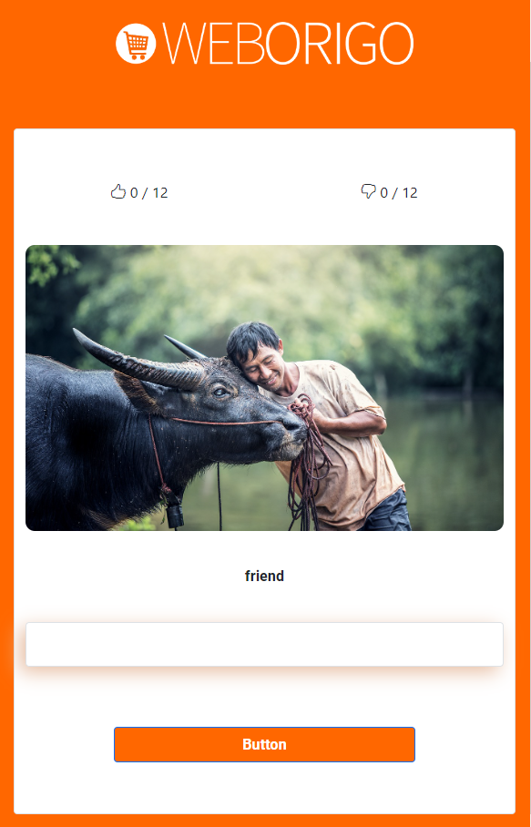

# LanguageLearner

<div id="top"></div>

[](https://gitpod.io/#https://github.com/ibrah3m/learning-repo/ibrahim-duleymioglu/tree/20221112_dev-ibrahim-duleymioglu)


<!-- PROJECT LOGO -->

<br />
<div align="center">
    
</div>

<h3 align="center">LEARN-WITH-LARAVEL</h3>

<p align="center">
    An awesome laravel project made for learning different languages!
    <br />
    <br />
    <a href="https://gitpod.io/#https://gitlab.weborigo.eu/interview-tasks/full-stack/medior/ibrahim-duleymioglu/-/tree/20221112_dev-ibrahim-duleymioglu">View Demo</a>
    ·
    <a href="https://gitlab.weborigo.eu/interview-tasks/full-stack/medior/ibrahim-duleymioglu/-/issues">Report Bug</a>
    ·
    <a href="https://gitlab.weborigo.eu/interview-tasks/full-stack/medior/ibrahim-duleymioglu/-/merge_requests">Request Feature</a>
  </p>
</div>

<!-- TABLE OF CONTENTS -->

<details>
  <summary>Table of Contents</summary>
  <ol>
    <li>
      <a href="#about-the-project">About The Project</a>
      <ul>
        <li><a href="#built-with">Built With</a></li>
      </ul>
    </li>
    <li>
      <a href="#getting-started">Getting Started</a>
      <ul>
        <li><a href="#prerequisites">Prerequisites</a></li>
        <li><a href="#installation">Installation</a></li>
      </ul>
    </li>
    <li><a href="#usage">Usage</a></li>
    <li><a href="#license">License</a></li>
    <li><a href="#contact">Contact</a></li>
    
  </ol>
</details>

<!-- ABOUT THE PROJECT -->

## About The Project



There are many great learning projects available on GitHub. However, I feel this one is better.

Here's why:

* its provide images with each word pairs 
* its counting for you the right and the wrong answers
* its built with vue :smile:

Of course, no one project will serve all needs since your needs may be different but what makes this project unique is the simplicity of the installation by paste just few lines!

Read the rest to get started

<p align="right">(<a href="#top">back to top</a>)</p>

### Built With

Frameworks/libraries used to build your project.

* [Laravel 9](https://laravel.com)
* [Bootstrap 5](https://getbootstrap.com)
* [VueJs 3](https://vuejs.org)

<p align="right">(<a href="#top">back to top</a>)</p>

<!-- GETTING STARTED -->

## Getting Started

In the few come lines, we will give you instructions about how to set up this repo inside your host so let's follow and enjoy this installation trip.

### Prerequisites

First in order to clonethis project inside your host use git as explained below .

- git 
  
  ```sh
  https://gitlab.weborigo.eu/interview-tasks/full-stack/medior/ibrahim-duleymioglu.git
  ```

### Installation

Below is an explanation of how you should install and set up the project inside your host.

1. move the project to your root then run the following commands one by one 
   
   ```sh
   composer install 
   ```

2. edit the enviroment file
   
   ```sh
   .env.example TO  .env 
   put the MySQL connection credentials etc.. Tag: public
   ```

3. migrate 
   
   ```sh
   php artisan migrate
   ```

4. seed
   
   ```shell
   php artisan db:seed
   ```

5. install npm libraries
   
   ```sh
   npm install
   ```

6. compile 
   
   ```shell
   npm run dev
   #or
   npx mix 
   ```

<p align="right">(<a href="#top">back to top</a>)</p>

<!-- USAGE EXAMPLES -->

## Usage

Here we go almost finsih , now you can use the project let's see  .

1. by postman
   
   ```shell
    #just make get request for this uri 
    http://www.example.com/api/words
   ```
   
   
   
   

2. by curl
   
   ```sh
   curl --location --request GET 'https://www.example.com/api/words'
   ```

3. by browser
   
   ```shell
    #just visit this uri 
   https://www.example.com
   ```


<p align="right">(<a href="#top">back to top</a>)</p>

<!-- LICENSE -->

## License

Distributed under the MIT License. See `LICENSE.txt` for more information.

<p align="right">(<a href="#top">back to top</a>)</p>

<!-- CONTACT -->

## Contact

Ibrahem Aljabr - [@website](https://ibrahem.org) 

Project Link: [(https://gitlab.weborigo.eu/interview-tasks/full-stack/medior/ibrahim-duleymioglu.git)](https://gitlab.weborigo.eu/interview-tasks/full-stack/medior/ibrahim-duleymioglu.git)

<p align="right">(<a href="#top">back to top</a>)</p>
